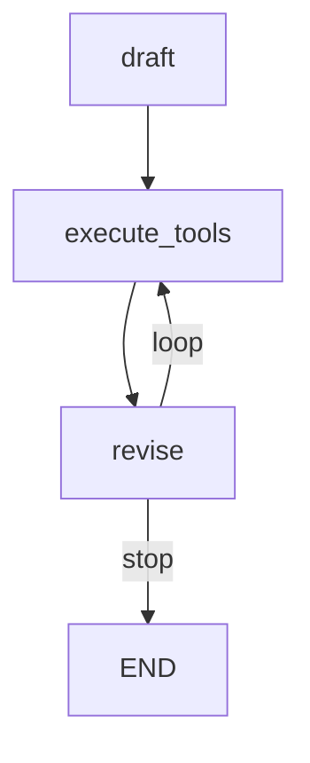

# 🪞 Reflexion Agent with LangGraph

This project demonstrates a **Reflexion-style agent** built using [LangGraph](https://github.com/langchain-ai/langgraph).  
The agent generates a draft, executes tools, and revises iteratively until the stopping condition is met.

---

## 📌 Features

- Reflexion-inspired workflow with multiple iterations.
- Built using `MessageGraph` from LangGraph.
- Nodes:
  - **draft** → Generates the first response using `first_responder`.
  - **execute_tools** → Executes external tools via `execute_tools`.
  - **revise** → Revises and refines the output using `revisor`.
- Conditional loop ensures the agent revises up to a maximum number of iterations (`MAX_ITERATIONS`).

---

## 🚀 How it Works

1. The agent starts at the **draft** node.
2. Executes tools if required.
3. Passes the result to the **revise** node.
4. Continues looping until:
   - The maximum iteration limit is reached, or
   - No further revisions are needed.

---

## 🛠️ Example Usage

```python
res = graph.invoke(
    "Write about AI-Powered SOC / autonomous SOC problem domain, list startups that do that and raised capital."
)
print(res[-1].tool_calls[0]["args"]["answer"])
print(res)
```

---

## 📊 Graph Visualization

The following Mermaid diagram illustrates the flow:



---

## 📦 Requirements

- Python 3.9+
- `langchain`
- `langgraph`
- Custom modules:
  - `chains.py` (with `revisor`, `first_responder`)
  - `tool_executor.py` (with `execute_tools`)

Install dependencies:

```bash
pip install -r requirements.txt
```

---

## 📝 Notes

- This project is an **example of Reflexion agents** using LangGraph.
- Extend it by integrating real-world tools and more advanced revision strategies.
